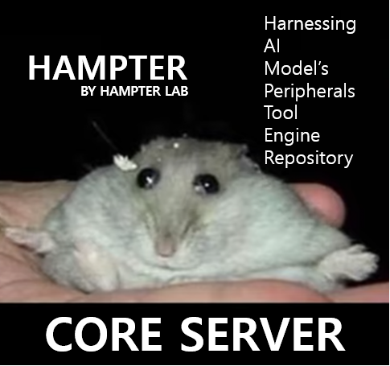

# HAMPTER Core Server

Core Server is the central engine of HAMPTER.  
It converts MQTT-connected devices into **MCP Tools that LLMs can use**, and manages data flow between devices.

---

## Quick Start

### 1. Run with Docker (Recommended)

```bash
cd core_server
docker-compose up -d
```

This starts three services:

| Service | Port | Description |
|---------|------|-------------|
| `mosquitto` | 1883 | MQTT Broker |
| `bridge` | 8083 (API/SSE), 8085 (IPC) | MCP Bridge Server |
| `manager` | 8084 | Web UI for configuration |

### 2. Configure Claude Desktop

Modify Claude Desktop's MCP configuration file to connect to HAMPTER.

**Config File Location:**

| OS | Path |
|----|------|
| Windows | `%APPDATA%\Claude\claude_desktop_config.json` |
| macOS | `~/Library/Application Support/Claude/claude_desktop_config.json` |
| Linux | `~/.config/Claude/claude_desktop_config.json` |

**Windows Example:**
```json
{
  "mcpServers": {
    "hampter-core": {
      "command": "C:\\Program Files\\nodejs\\npx.cmd",
      "args": ["-y", "@anthropic-ai/mcp-proxy@0.6.1", "http://localhost:8083/sse/sse"]
    }
  }
}
```

**macOS/Linux Example:**
```json
{
  "mcpServers": {
    "hampter-core": {
      "command": "npx",
      "args": ["-y", "@anthropic-ai/mcp-proxy@0.6.1", "http://localhost:8083/sse/sse"]
    }
  }
}
```

> **Note:** `command` is the path to `npx`. Windows requires absolute path.  
> `http://localhost:8083/sse/sse` is HAMPTER's MCP SSE endpoint.

### 3. Restart Claude Desktop

After saving the config, restart Claude Desktop. You should see HAMPTER tools available.

---

## Running Locally (Development)

If you prefer running without Docker:

```bash
# 1. Start MQTT Broker (install mosquitto first)
mosquitto -c mosquitto.conf

# 2. Start Bridge
python run_bridge.py

# 3. (Optional) Start Manager UI
python run_manager.py
```

**Environment Variables:**
- `MQTT_HOST`: MQTT broker address (default: `localhost`)
- `MQTT_PORT`: MQTT port (default: `1883`)
- `API_PORT`: Bridge API port (default: `8083`)

---

## Features

### Tool Projection
Rename, change descriptions, or disable device tools to make them **LLM-friendly**.

Example: A simple `rotate_motor` tool can become:
- `open_bedroom_window`
- `close_bedroom_window`

This allows LLMs to understand **intent**, not just function.

**Config:** `config/projection_config.json`

```json
{
  "devices": {
    "dev-MOTOR01": {
      "enabled": true,
      "tools": {
        "rotate_motor": {
          "enabled": true,
          "alias": "open_bedroom_window",
          "description": "Opens the bedroom window"
        }
      }
    }
  }
}
```

---

## Experimental Features

> ⚠️ These features are still in development and may contain bugs.

### Port Routing
Connect **sensor outputs, states, and values** between devices.

- **OutPort**: Outputs values (sensor readings, states)
- **InPort**: Receives values from other devices

Example: Connect impact sensor → LED brightness
```
[Impact Sensor] OutPort: impact → [LED] InPort: brightness
```

Supports **transforms**:
- `scale`: Multiply value
- `offset`: Add to value
- `threshold`: Compare against threshold

**Config:** `config/routing_config.json`

---

### Virtual Tool
**Bundle multiple tools into one** and execute them in parallel.

Example: "Morning Routine" = Turn on lights + Start coffee + Play music
```json
{
  "virtual_tools": {
    "morning_routine": {
      "description": "Execute morning routine",
      "bindings": [
        { "device_id": "light_01", "tool": "turn_on" },
        { "device_id": "coffee", "tool": "brew" },
        { "device_id": "speaker", "tool": "play_music" }
      ]
    }
  }
}
```

**Planned:** Scheduling support.

**Config:** `config/virtual_tools.json`

---

### IPC Agent
Connect **software-based agents** (not hardware) to HAMPTER.

Use Python scripts or other programs to:
- Send/receive **Port values**
- Register as **HAMPTER Tools** callable by LLMs

**Example:** TTS Agent
```python
from saba_ipc import SabaIPCClient

client = SabaIPCClient("tts_agent", "TTS Service")

# OutPort: Expose current state
client.add_outport("is_speaking", "bool", "Currently speaking")

# Tool: LLM can call this
@client.tool(name="speak", description="Speak the given text")
def speak(text: str):
    # TTS logic...
    return "Done"

client.start()
```

---

## File Structure

```
core_server/
├── bridge_mcp/           # MCP Bridge
│   ├── server.py         # FastMCP server
│   ├── mqtt.py           # MQTT handling
│   ├── tool_projection.py# Tool Projection
│   ├── virtual_tool.py   # Virtual Tool
│   └── ipc.py            # IPC server
├── mcp_manager/          # Web UI
├── port_routing.py       # Port Routing
├── saba_ipc.py           # IPC Client SDK
├── config/               # Configuration files
└── docker-compose.yml
```

---

## Troubleshooting

### Claude Desktop doesn't see HAMPTER tools
1. Make sure Docker containers are running: `docker ps`
2. Check if Bridge is healthy: `curl http://localhost:8083/healthz`
3. Verify config file syntax (valid JSON)
4. Restart Claude Desktop

### Devices not appearing
1. Check MQTT connection: `mosquitto_sub -t "mcp/#" -v`
2. Ensure device is sending announce messages
3. Check Bridge logs: `docker logs mcp-bridge`

